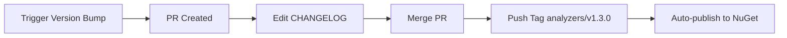

# Release Scripts

## Version Bumping

### Local (Manual)

```powershell
# Bump Analyzers to stable version
.\scripts\bump-version.ps1 -Version 1.3.0

# Bump to prerelease
.\scripts\bump-version.ps1 -Version 1.3.0 -Prerelease beta
```

### Automated (GitHub Actions)

1. Go to **Actions** → **Version Bump PR**
2. Click **Run workflow**
3. Enter new version (e.g., `1.3.0`)
4. Optionally add prerelease suffix (e.g., `beta`)
5. Click **Run**

This creates a PR with:
- Updated version in `Lintelligent.Analyzers.csproj`
- New section in `src/Lintelligent.Analyzers/CHANGELOG.md` (edit before merging!)
- Automated commit and branch

## Publishing

### Automated (Recommended)

After merging version bump PR:

```bash
# Tag with package prefix
git tag analyzers/v1.3.0
git push origin analyzers/v1.3.0
```

The publish workflow automatically:
- ✅ Runs tests
- 📦 Packs Lintelligent.Analyzers
- 🚀 Pushes to NuGet.org (via Trusted Publishing)

**No GitHub Release needed** - the tag trigger is enough!

### Manual

```powershell
# Pack packages
dotnet pack src/Lintelligent.Analyzers -c Release -o ./nupkgs
dotnet pack src/Lintelligent.CodeFixes -c Release -o ./nupkgs

# Push to NuGet (requires API key)
dotnet nuget push ./nupkgs/*.nupkg --source https://api.nuget.org/v3/index.json
```

## Workflow Summary



## Tag Naming Convention

- **Lintelligent.Analyzers**: `analyzers/v1.2.0`
- **Lintelligent.CodeFixes** (future): `codefixes/v1.0.0`
- **Lintelligent.Cli** (future): `cli/v2.0.0`

This allows independent versioning of each package in the monorepo.

## Version Strategy

- **Major** (2.0.0): Breaking changes
- **Minor** (1.3.0): New features, backward compatible
- **Patch** (1.2.1): Bug fixes only
- **Prerelease** (1.3.0-beta): Testing/preview versions
