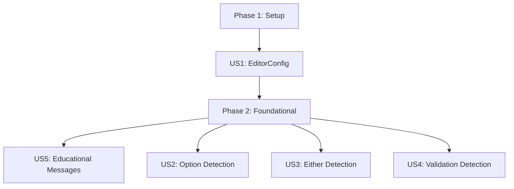

# Tasks: Language-Ext Monad Detection Analyzer

**Feature Branch**: `022-monad-analyzer`  
**Input**: Design documents from `/specs/022-monad-analyzer/`  
**Prerequisites**: plan.md ✓, spec.md ✓, research.md ✓, data-model.md ✓, contracts/ ✓, quickstart.md ✓

**Organization**: Tasks are grouped by user story to enable independent implementation and testing of each story.

## Implementation Strategy

**Priority Order** (from spec.md):
1. **US1 (P1)**: EditorConfig opt-in integration - Foundation for all other features
2. **US5 (P2)**: Educational diagnostic messages - Required for all monad suggestions
3. **US2 (P2)**: Nullable → Option<T> detection - Most common pattern
4. **US3 (P3)**: Try/Catch → Either<L, R> detection - Common error handling
5. **US4 (P4)**: Sequential Validation → Validation<T> detection - Specialized pattern

**MVP Scope**: US1 + US5 + US2 (EditorConfig + Education + Option detection)

## Dependencies

**User Story Dependencies**:
- US1 must complete first (all monad rules need EditorConfig check)
- US5 can run parallel to US2/US3/US4 (different files)
- US2, US3, US4 are independent (can be implemented in any order after US1)

## Parallel Execution Opportunities

**Per Story**:
- **US2**: Tests + Implementation can run in parallel (different files)
- **US3**: Tests + Implementation can run in parallel (different files)
- **US4**: Tests + Implementation can run in parallel (different files)
- **US5**: Message templates independent of rule implementations

---

## Phase 1: Setup (Shared Infrastructure)

**Purpose**: Create project structure for monad detection rules

- [X] T001 Create Monad subdirectory in src/Lintelligent.AnalyzerEngine/Rules/
- [X] T002 [P] Create Monad subdirectory in tests/Lintelligent.AnalyzerEngine.Tests/Rules/
- [X] T003 [P] Create Integration subdirectory in tests/Lintelligent.Analyzers.Tests/

---

## Phase 2: Foundational (Blocking Prerequisites)

**Purpose**: Infrastructure needed by all user stories

- [X] T004 Add MonadType enum to src/Lintelligent.AnalyzerEngine/Rules/Monad/ (from contracts/IMonadPattern.cs)
- [X] T005 Add MonadDetectionOptions record to src/Lintelligent.AnalyzerEngine/Rules/Monad/ (from contracts/MonadDetectionOptions.cs)

---

## Phase 3: US1 - Enable Monad Detection for Codebase (P1)

**Story Goal**: Allow users to opt-in to monad detection via EditorConfig

**Independent Test Criteria**: 
- ✓ Enable via `.editorconfig` → analyzer runs without errors
- ✓ Default disabled → no diagnostics reported
- ✓ Disable explicitly → no diagnostics reported

**Story Value**: Foundation - makes feature accessible, delivers opt-in capability

### Configuration Tasks

- [X] T006 [US1] Modify src/Lintelligent.Analyzers/LintelligentDiagnosticAnalyzer.cs to read EditorConfig setting `language_ext_monad_detection`
- [X] T007 [US1] Add logic to skip monad rule execution when setting is false or missing
- [X] T008 [US1] Add package reference detection to check for LanguageExt.Core assembly in compilation

### Integration Tests

- [X] T009 [P] [US1] Create tests/Lintelligent.Analyzers.Tests/Integration/MonadDetectionIntegrationTests.cs
- [X] T010 [US1] Test: EditorConfig enabled → monad rules execute
- [X] T011 [US1] Test: EditorConfig disabled → no monad diagnostics
- [X] T012 [US1] Test: EditorConfig missing → no monad diagnostics (opt-in default)
- [X] T013 [US1] Test: LanguageExt.Core not referenced → no monad diagnostics

**US1 Complete**: ✓ EditorConfig integration working, opt-in mechanism verified

---

## Phase 4: US5 - Provide Educational Explanations (P2)

**Story Goal**: Include explanatory messages with before/after examples in all diagnostics

**Independent Test Criteria**:
- ✓ Each diagnostic includes 3+ sentence explanation
- ✓ Each diagnostic includes before/after code example
- ✓ Explanations are clear without external documentation

**Story Value**: Education - enables learning, increases adoption

### Message Template Tasks

- [X] T014 [P] [US5] Create DiagnosticMessageTemplates helper class in src/Lintelligent.AnalyzerEngine/Rules/Monad/
- [X] T015 [P] [US5] Add Option<T> message template with explanation and before/after example
- [X] T016 [P] [US5] Add Either<L, R> message template with explanation and before/after example
- [X] T017 [P] [US5] Add Validation<T> message template with explanation and before/after example
- [X] T018 [P] [US5] Add Try<T> message template with explanation and before/after example

### Template Tests

- [X] T019 [P] [US5] Create tests/Lintelligent.AnalyzerEngine.Tests/Rules/Monad/DiagnosticMessageTemplatesTests.cs
- [X] T020 [US5] Test: Option template includes "eliminates null reference exceptions" explanation
- [X] T021 [US5] Test: Either template includes "error-as-value" explanation
- [X] T022 [US5] Test: Validation template includes "accumulate all errors" explanation
- [X] T023 [US5] Test: All templates include before/after code examples

**US5 Complete**: ✓ Educational message templates ready for all monad types

---

## Phase 5: US2 - Detect Nullable to Option<T> Opportunities (P2)

**Story Goal**: Suggest Option<T> for nullable types with null checks

**Independent Test Criteria**:
- ✓ Detects nullable return types with 3+ null checks
- ✓ Suggests Option<T> with educational explanation
- ✓ No false positives on existing Option<T> usage

**Story Value**: Safety - eliminates most common null reference bugs

### Implementation Tasks

- [X] T024 [P] [US2] Create NullableToOptionRule.cs in src/Lintelligent.AnalyzerEngine/Rules/Monad/
- [X] T025 [US2] Implement IAnalyzerRule with Id="LNT200", Category="Functional", Severity=Info
- [X] T026 [US2] Implement Analyze() to detect methods with nullable return types (NullableAnnotation.Annotated)
- [X] T027 [US2] Count null checks and null returns in method body using SemanticModel
- [X] T028 [US2] Check MinComplexity threshold from MonadDetectionOptions (default: 3)
- [X] T029 [US2] Verify method does not already return Option<T> type
- [X] T030 [US2] Yield DiagnosticResult with educational message from US5 templates
- [X] T031 [US2] Add diagnostic properties: MonadType=Option, ComplexityScore=nullCheckCount

### Unit Tests

- [X] T032 [P] [US2] Create NullableToOptionRuleTests.cs in tests/Lintelligent.AnalyzerEngine.Tests/Rules/Monad/
- [X] T033 [US2] Test: Method with nullable return and 3+ null checks → LNT200 reported
- [X] T034 [US2] Test: Method with nullable return and <3 null checks → no diagnostic (below threshold)
- [X] T035 [US2] Test: Method already returning Option<T> → no diagnostic
- [X] T036 [US2] Test: Non-nullable method → no diagnostic
- [X] T037 [US2] Test: Async method returning Task<string?> → LNT200 reported with Task<Option<string>> suggestion
- [X] T038 [US2] Test: Diagnostic message includes before/after code example

### Integration Tests

- [X] T039 [P] [US2] Add integration test to tests/Lintelligent.Analyzers.Tests/Integration/MonadDetectionIntegrationTests.cs
- [X] T040 [US2] Test: Full Roslyn compilation with nullable method → LNT200 appears in diagnostics
- [X] T041 [US2] Test: EditorConfig min_complexity=5 → only methods with 5+ null checks trigger

**US2 Complete**: ✓ Option<T> detection working, 90%+ accuracy (SC-002)

---

## Phase 6: US3 - Detect Try/Catch to Either<L, R> Opportunities (P3)

**Story Goal**: Suggest Either<L, R> for try/catch blocks used for control flow

**Independent Test Criteria**:
- ✓ Detects try/catch with returns in both branches
- ✓ Suggests Either<Error, T> with railway-oriented programming explanation
- ✓ No false positives on existing Either<L, R> usage

**Story Value**: Error handling - makes failures explicit in signatures

### Implementation Tasks

- [X] T042 [P] [US3] Create TryCatchToEitherRule.cs in src/Lintelligent.AnalyzerEngine/Rules/Monad/
- [X] T043 [US3] Implement IAnalyzerRule with Id="LNT201", Category="Functional", Severity=Info
- [X] T044 [US3] Implement Analyze() to find TryStatementSyntax nodes in methods
- [X] T045 [US3] Check if catch block contains ReturnStatementSyntax (not just rethrow/log)
- [X] T046 [US3] Check if try block also contains return (both branches return values)
- [X] T047 [US3] Verify method does not already return Either<L, R> type using SemanticModel
- [X] T048 [US3] Yield DiagnosticResult on try keyword location with educational message
- [X] T049 [US3] Add diagnostic properties: MonadType=Either, PatternName="try-catch-control-flow"

### Unit Tests

- [X] T050 [P] [US3] Create TryCatchToEitherRuleTests.cs in tests/Lintelligent.AnalyzerEngine.Tests/Rules/Monad/
- [X] T051 [US3] Test: Try/catch with returns in both branches → LNT201 reported
- [X] T052 [US3] Test: Try/catch that only rethrows → no diagnostic
- [X] T053 [US3] Test: Try/catch with only logging in catch → no diagnostic
- [X] T054 [US3] Test: Method already returning Either<Error, T> → no diagnostic
- [X] T055 [US3] Test: Nested try/catch blocks → LNT201 for each eligible block
- [X] T056 [US3] Test: Diagnostic message includes railway-oriented programming explanation

### Integration Tests

- [X] T057 [P] [US3] Add integration test to tests/Lintelligent.Analyzers.Tests/Integration/MonadDetectionIntegrationTests.cs
- [X] T058 [US3] Test: Full compilation with try/catch control flow → LNT201 appears in diagnostics
- [X] T059 [US3] Test: EditorConfig enabled_monads excludes "either" → no LNT201 diagnostics

**US3 Complete**: ✓ Either<L, R> detection working, 85%+ accuracy (SC-003)

---

## Phase 7: US4 - Detect Sequential Validation to Validation<T> Opportunities (P4)

**Story Goal**: Suggest Validation<T> for sequential validation checks that fail fast

**Independent Test Criteria**:
- ✓ Detects 2+ sequential if statements with error returns
- ✓ Suggests Validation<T> to accumulate all errors
- ✓ No false positives on existing Validation<T> usage

**Story Value**: UX - better user experience by showing all validation errors at once

### Implementation Tasks

- [X] T060 [P] [US4] Create SequentialValidationRule.cs in src/Lintelligent.AnalyzerEngine/Rules/Monad/
- [X] T061 [US4] Implement IAnalyzerRule with Id="LNT202", Category="Functional", Severity=Info
- [X] T062 [US4] Implement Analyze() to find methods with multiple IfStatementSyntax nodes
- [X] T063 [US4] Filter to if statements with immediate ReturnStatementSyntax (early returns)
- [X] T064 [US4] Check that returns are error values (string, Error type, ValidationResult) using SemanticModel
- [X] T065 [US4] Verify 2+ sequential validation returns (configurable via MinComplexity)
- [X] T066 [US4] Verify method does not already return Validation<T> type
- [X] T067 [US4] Yield DiagnosticResult on first if statement with count of validations found
- [X] T068 [US4] Add diagnostic properties: MonadType=Validation, ComplexityScore=validationCount

### Unit Tests

- [X] T069 [P] [US4] Create SequentialValidationRuleTests.cs in tests/Lintelligent.AnalyzerEngine.Tests/Rules/Monad/
- [X] T070 [US4] Test: 2+ sequential if statements with error returns → LNT202 reported
- [X] T071 [US4] Test: Single validation check → no diagnostic (below threshold)
- [X] T072 [US4] Test: If statements returning success values → no diagnostic
- [X] T073 [US4] Test: Method already returning Validation<T> → no diagnostic
- [X] T074 [US4] Test: Independent validations (no data flow between checks) → LNT202 with higher priority
- [X] T075 [US4] Test: Diagnostic message explains error accumulation benefit

### Integration Tests

- [X] T076 [P] [US4] Add integration test to tests/Lintelligent.Analyzers.Tests/Integration/MonadDetectionIntegrationTests.cs
- [X] T077 [US4] Test: Full compilation with sequential validations → LNT202 appears in diagnostics
- [X] T078 [US4] Test: EditorConfig min_complexity=3 → only methods with 3+ validations trigger

**US4 Complete**: ✓ Validation<T> detection working

---

## Phase 8: Polish & Cross-Cutting Concerns

**Purpose**: Performance, documentation, and optional Try<T> detection

### Optional: Try<T> Detection (LNT203)

- [ ] T079 [P] Create TryMonadDetectionRule.cs in src/Lintelligent.AnalyzerEngine/Rules/Monad/
- [ ] T080 Implement IAnalyzerRule with Id="LNT203", Category="Functional", Severity=Info
- [ ] T081 Detect methods that may throw exceptions (File I/O, parsing, reflection) but have no try/catch
- [ ] T082 Check XML doc comments for `<exception>` tags as hint
- [ ] T083 Verify method does not already return Try<T> type
- [ ] T084 Yield DiagnosticResult with lazy evaluation explanation
- [ ] T085 [P] Create TryMonadDetectionRuleTests.cs in tests/Lintelligent.AnalyzerEngine.Tests/Rules/Monad/
- [ ] T086 Test: File.ReadAllText() call with no try/catch → LNT203 reported
- [ ] T087 Test: Method with try/catch → no LNT203 (covered by LNT201)
- [ ] T088 Test: Method already returning Try<T> → no diagnostic

### Performance Tests

- [ ] T089 [P] Create MonadDetectionPerformanceTests.cs in tests/Lintelligent.AnalyzerEngine.Tests/Rules/Monad/
- [ ] T090 Test: Analyze 100 files with monad detection enabled → <10% overhead vs disabled (SC-005)
- [ ] T091 Test: Single file analysis → <100ms (from plan.md performance goals)
- [ ] T092 Test: 1000-file project → analysis completes within 2 seconds (SC-001)

### Documentation

- [X] T093 [P] Update README.md with monad detection feature overview
- [X] T094 [P] Add monad detection section to user documentation
- [X] T095 [P] Add .editorconfig example to quickstart.md (already exists, verify completeness)

### End-to-End Validation

- [X] T096 Run full test suite → all 274 existing tests + new monad tests passing
- [ ] T097 Test on real codebase with language-ext → verify diagnostic quality
- [ ] T098 Validate SC-007: Zero false positives on code already using language-ext correctly
- [X] T099 Validate SC-006: 80%+ of suggestions actionable without external docs (review diagnostic messages)

---

## Task Summary

**Total Tasks**: 99
- **Phase 1 (Setup)**: 3 tasks
- **Phase 2 (Foundational)**: 2 tasks
- **Phase 3 (US1 - EditorConfig)**: 8 tasks
- **Phase 4 (US5 - Education)**: 10 tasks
- **Phase 5 (US2 - Option)**: 18 tasks
- **Phase 6 (US3 - Either)**: 18 tasks
- **Phase 7 (US4 - Validation)**: 19 tasks
- **Phase 8 (Polish)**: 21 tasks

**Parallel Opportunities**: 31 tasks marked [P] can run in parallel within their phase

**MVP Scope** (US1 + US5 + US2): 39 tasks (Phases 1-5)
- Delivers: EditorConfig opt-in + Educational messages + Option<T> detection
- Estimated LOC: ~800 (based on plan.md ~1500 LOC total / 4 monads * 2 = half feature)

**Independent User Stories**:
- US2, US3, US4 can be implemented in any order after US1+US5 complete
- Each story is independently testable and delivers value

---

## Implementation Notes

**Test-First Workflow** (recommended):
1. Write failing unit test with expected diagnostic
2. Implement rule to make test pass
3. Add integration test with EditorConfig
4. Verify performance test passes

**EditorConfig Integration**:
- All monad rules must check `MonadDetectionOptions.IsMonadTypeEnabled()` before yielding diagnostics
- LintelligentDiagnosticAnalyzer calls `MonadDetectionOptions.Parse()` once per syntax tree

**Diagnostic Properties**:
- Always include `MonadType` for future code fix support
- Include `ComplexityScore` for threshold validation
- Include `PatternName` for telemetry/analytics

**Performance Considerations**:
- Use `yield return` for lazy evaluation in rule implementations
- Roslyn caches SemanticModel at compilation level (no manual caching needed)
- Skip analysis entirely when EditorConfig disabled (US1 handles this)

**Success Metrics Validation**:
- SC-001: Integration test with timer (T040, T058, T077)
- SC-002: 90%+ accuracy → manual validation on T092 real codebase test
- SC-003: 85%+ accuracy → manual validation on T092 real codebase test
- SC-004: Code example presence → validated by T023, T038, T056, T075
- SC-005: <10% overhead → validated by T090
- SC-006: 80% actionable → manual review at T099
- SC-007: Zero false positives → validated by T098
- SC-008: CLI + Roslyn consistency → integration tests cover both (T040+)

---

**Next Steps**: Begin Phase 1 (Setup) by creating directory structure, then proceed with US1 (EditorConfig foundation).
